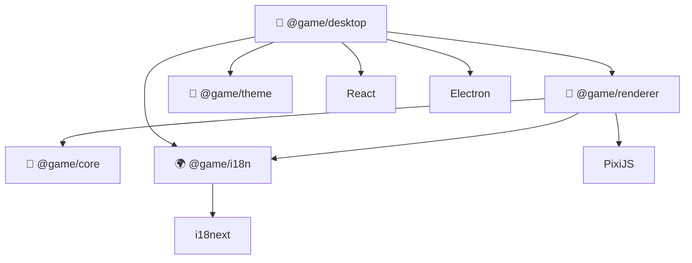
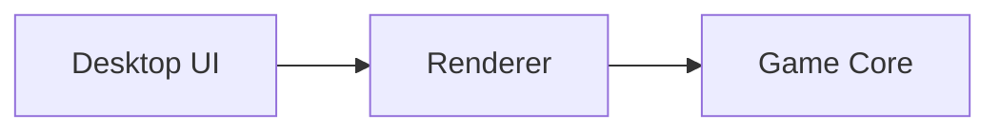

# 🔮 How to heal?! (game project)

A cross-platform game project built as a TypeScript monorepo.

## 🏗 Architecture



## 📦 Monorepo structure

```text
.
├── apps/
│   ├── desktop/              # Electron desktop application
│   └── mobile/               # React Native mobile application
│
├── packages/
│   ├── core/                 # Game domain and business logic
│   ├── renderer/             # Game rendering abstraction and PixiJS implementation
│   ├── i18n/                 # Shared localization
│   └── theme/                # Shared design tokens and theme
│
├── turbo.json
├── pnpm-workspace.yaml
└── package.json
```

## 🏰 Desktop

### Run Development Mode

```bash
pnpm install
pnpm turbo run dev --filter=@game/desktop
```

> Requirements: Node.js 22+, pnpm

## 🧩 Packages

### 📜 `@game/core`

Contains platform-independent game logic.

This package should not depend on:

* Electron
* React
* PixiJS
* React Native

The goal is to keep the game domain independent from the UI platform.

### 🐉 `@game/renderer`

Contains the rendering abstraction and its implementation.

Currently uses PixiJS.

```text
Game state
    ↓
@game/core
    ↓
Renderer interfaces
    ↓
PixiJS implementation
```

This allows the rendering implementation to be replaced in the future without changing the game domain.

### 🌍 `@game/i18n`

Shared localization package based on `i18next`.

Can be used by:

* React through `react-i18next`
* PixiJS renderer through the core `i18next` instance

### 🦄 `@game/theme`

Contains shared UI design tokens and theme definitions.

## 🔄 Dependency direction



The core game logic should remain independent from rendering and platform-specific code.
